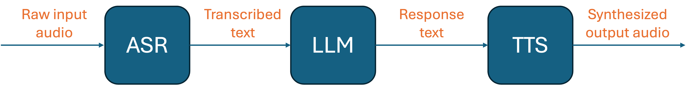

# Cascaded Speech Pipeline

This repo builds a cascaded speech pipeline that
- Accepts raw speech input (e.g. from a WAV file),
- Transcribes to text via STT/ASR block,
- Feeds the transcription to a pretrained LLM for response generation,
- Converts LLM response back to audio via TTS block,
- Saves the speech output into a WAV file. 

A minimal Web demo is also provided where a user can record or upload a short utterance 
and hear back the synthesized reply.

## Installation
Refer to [INSTALL.md](INSTALL.md) for development environment setup.

## Usage
Refer to [USAGE.md](USAGE.md) for how to run the pipeline and the demo.

## Design
Refer to [DESIGN.md](DESIGN.md) for design decisions.
