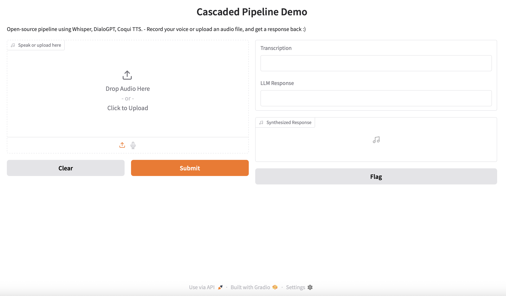
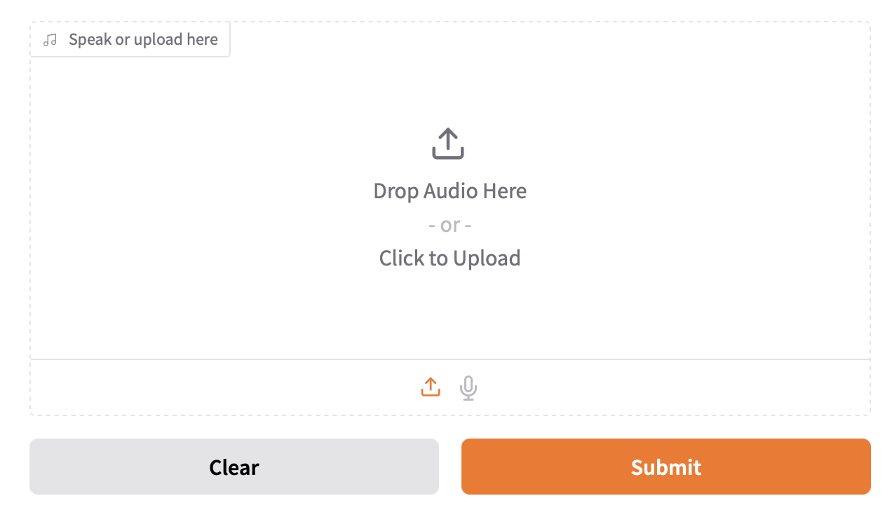
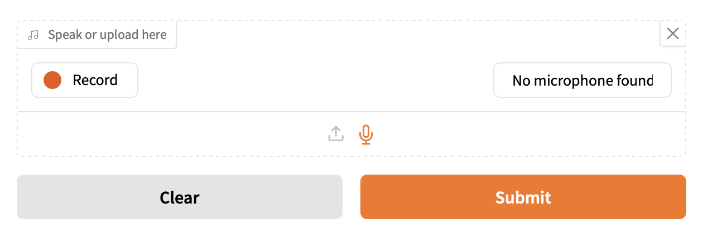
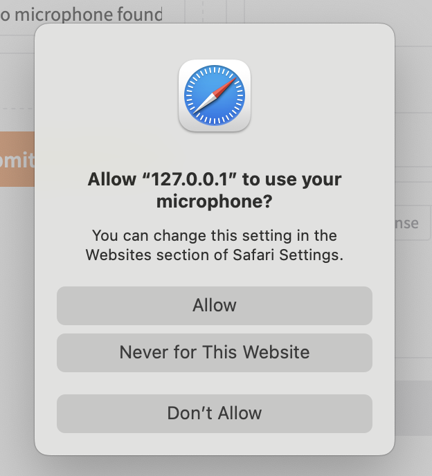
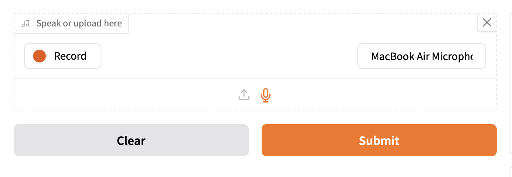
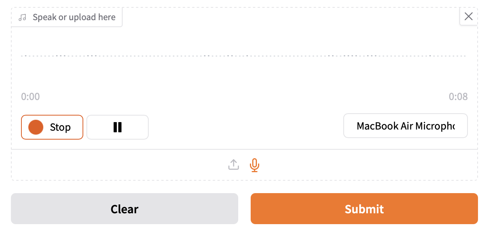
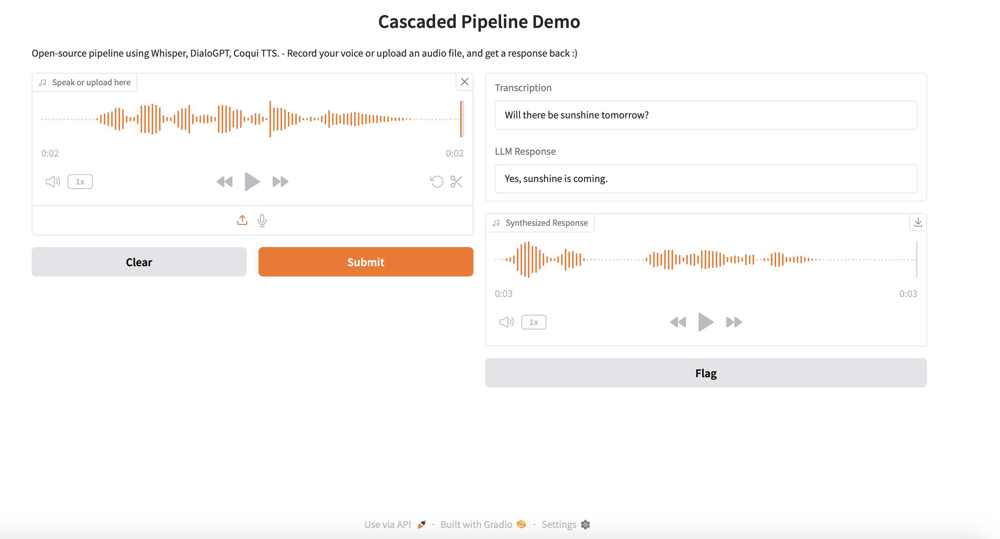

## How to Run Cascaded Pipeline

Navigate to the project folder and run the script as follows:
```
cd Python/projects/cascaded-speech-pipeline
python3.10 cascaded_pipeline.py --input_audio <path/to/your_file>.wav
```
If you omit `--input_audio`, it will fall back to the example input file 
[Will_There_Be_Sunshine_Tomorrow.wav](example_files/Will_There_Be_Sunshine_Tomorrow.wav)

Expect to have some delay for the first run after a fresh install due to model fetching and 
initialization.

Example input and output files are located under [example_files](example_files) folder.

## How to Run Cascaded Pipeline Demo

Navigate to the project folder and run the demo script as follows:
```
cd Python/projects/cascaded-speech-pipeline
python3.10 cascaded_pipeline_demo.py 
```

This will download and initialize the models. Later, you will see such a line on the terminal:
```
Running on local URL:  http://127.0.0.1:7860
```
Click to http://127.0.0.1:7860 or copy the URL into your browser.  

On your browser, you will see the demo onboarding page as follows:



Here, you have two options to provide your speech audio:

1) Click to upload your audio file.

   

2) Press the microphone icon to record your voice. You need to press **Record** button to start 
   recording your voice. Note that your might need to give your browser access right to use your 
   microphone. When you are done, click **Stop** to finish recording. 
   
   
   
   
   

Once you see the speech waveform on the left, you can listen and **Submit**. 

Then, the cascaded speech pipeline will run, and you will see the results on the right as 
follows:   

   

You can try multiple times by uploading new files and/or record new voices. It is also possible to 
trim the recorded voice.

If you click on **Flag** button on the right, you can save the input and output wav files.
It also saves the transcribed text and LLM text response into a .csv file. You can find the 
saved files and the .csv file under [.gradio/flagged](.gradio/flagged) folder.

## How to Run Cascaded Pipeline with Streaming

Navigate to the project folder and run the streaming pipeline script as follows:
```
cd Python/projects/cascaded-speech-pipeline
python3.10 cascaded_pipeline_streaming.py
```

It will start the real time streaming. Once you start speaking, you should see:
```
Detected first voice input. Starting speech buffering...
```

and once you stop speaking, you should see:
```
End of speech segment. Now processing this speech segment...
```

While processing this request, the incoming audio will be dropped and you will see:
```
Audio queue full — dropping frame.
Audio queue full — dropping frame.
```

Note that, the streaming pipeline demo is not fully optimized, it is in WIP state.